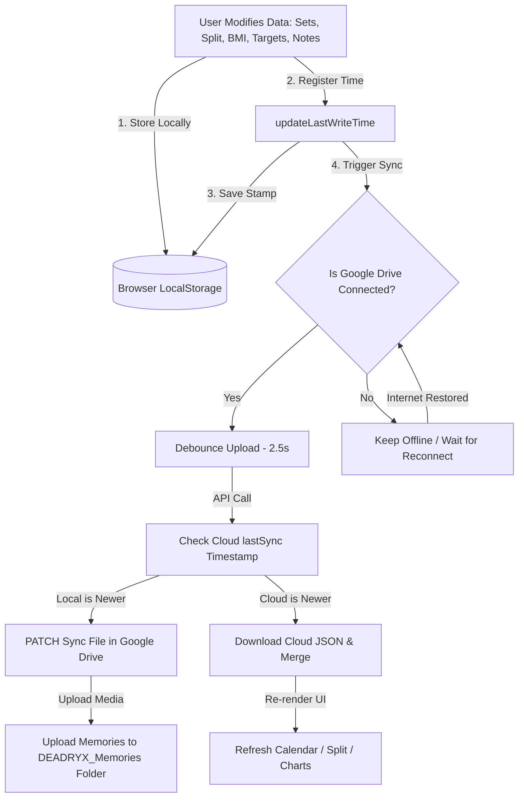

# DEADRYX: Modern, Offline-First Gym Planner & Strength Dashboard
## Executive Technical Summary & Product Specification

**DEADRYX** is a state-of-the-art, offline-first Progressive Web Application (PWA) designed for strength training, gym planning, and progress tracking. It operates with zero database server costs and absolute user data privacy by storing training history directly in the user's browser client and syncing it securely to their personal Google Drive.

---

## 1. Executive Summary

Traditional fitness apps require expensive monthly subscriptions, force account creation, display intrusive ads, and suffer from high server maintenance costs. 

**DEADRYX solves these pain points by using a serverless client-side architecture:**
* **Zero Hosting & DB Costs:** All calculations, chart rendering, and data storage occur locally on the user's device. No database server is required.
* **100% Privacy-First:** User data (workouts, weight metrics, personal memories) is stored exclusively on the user's device. Developers and servers have zero access to any user data — ever.
* **Cross-Device Sync:** Seamless synchronization across mobile and desktop devices using the user's personal Google Drive file storage.

---

## 2. Core Feature Specifications & How They Work

### 2.1. Dynamic Workout Scheduler & Logger
* **Feature:** A fully custom weekly split scheduler and active exercise logger.
* **How It Works:**
  1. The app loads the weekly split configuration (`deadryx-split-config-v1`) from local storage.
  2. Users select a training day (e.g., "Monday - Chest & Biceps") to open the active Exercise Log.
  3. Input fields capture weight and rep entries for 3 distinct sets per exercise.
  4. Hitting **"Save Today's Workout"** stores entries in local storage and commits them to the historical log, automatically setting the new entries as the "Previous Data" targets for the next week's session.

### 2.2. Intelligent Google Drive Sync Engine
* **Feature:** Automatic background backup and multi-device state synchronization.
* **How It Works:**
  1. **Safe DOM Isolation:** The sync engine executes globally across all pages (`dashboard`, `notes`, `analysis`, `memories`), ignoring missing sidebar elements on subpages to avoid runtime errors.
  2. **Timestamped Conflict Resolution (Last-Write-Wins):** When syncing, the engine compares the local modification timestamp (`deadryx-last-write-v1`) against the cloud file's sync timestamp (`_meta.lastSync`). Whichever modification is newer is automatically chosen as the master copy, preventing data loss.
  3. **Debounced Writes:** To avoid overloading Google API limits and rate throttling, uploads are debounced by **2.5 seconds** (`uploadToDrive`). This groups rapid actions (like typing gym notes or updating several sets) into a single API request.
  4. **Auto-reconnect Sync:** If a user loses internet, changes are safely kept in `localStorage`. Once the browser detects a network reconnection, the app automatically triggers a sync to push the offline edits to the cloud.

### 2.3. Personal Record (PR) Monitor & Confetti System
* **Feature:** Automatically detects when a user hits a new maximum weight or rep target, triggering instant visual celebrations.
* **How It Works:**
  1. Every time a workout is saved, the PR engine (`detectAndRecordPR`) queries the historical PR ledger (`deadryx-pr-records-v1`).
  2. If the saved weight is higher than the historical maximum (or matches the weight but with higher reps), a new PR is registered.
  3. The app fires an high-performance canvas confetti animation (`confetti.browser.min.js`) and displays a custom-designed sliding visual toast highlighting the achievement and the previous target.

### 2.4. Progress Analytics & Goal Deadlines
* **Feature:** Visual graphing of maximum lift progression combined with goal setting.
* **How It Works:**
  1. Fetches historical entries from `deadryx-historical-log-v1` and maps the maximum weight lifted per day.
  2. Renders dynamic trends on an HTML5 Canvas using `Chart.js` for "This Year" or "Lifetime" windows.
  3. Users can input a "Target Weight" and a "Deadline Date".
  4. Once locked, a **custom horizontal target line** is drawn on the chart. If the user hits or exceeds this weight, the app automatically unlocks the target input, allowing them to set a new milestone.

### 5. Interactive BMI & Nutrition Calculator
* **Feature:** Metric/Imperial BMI analyzer, weight logging, and tailored dietary calculations.
* **How It Works:**
  1. Converts inputs (kg/lbs, cm/ft+in) into standard SI units.
  2. Calculates body mass index: $BMI = \frac{Weight (kg)}{Height (m)^2}$.
  3. Renders a color-coded physical scale (Underweight, Healthy, Overweight, Obese) and draws a progress canvas chart showing bodyweight vs. BMI trends.
  4. Applies the **Gym Nutrition Formula**:
     - *Protein:* Bodyweight (kg) × 2 (g)
     - *Fat:* Bodyweight (kg) × 0.8 (g)
     - *Calories:* Tailored for Maintenance (Weight × 33), Clean Bulking (+400 kcal), or Cutting (-500 kcal).
     - *Carbohydrates:* Calculates remaining calorie allotment divided by 4.

### 6. Media memories Timeline
* **Feature:** An aesthetic photo/video diary keeping track of physical transformations, with real-time upload feedback and full-screen viewing.
* **How It Works:**
  1. Photos and video clips are stored locally on the client's device using browser-native **IndexedDB** (`MemoriesDB`), bypassing standard local storage size caps (5MB) to handle large media files.
  2. Media metadata maps are synced through Google Drive to retrieve filenames and sync states.
  3. Downloads and updates missing images from the user's `DEADRYX_Memories` Drive folder in the background.
  4. **Upload Status Toast:** A premium animated toast notification system tracks the entire upload lifecycle — showing a spinning loader with file name/size during processing, transitioning to an animated checkmark on success, or displaying an error state with details if something fails. The toast auto-dismisses after 3.5 seconds.
  5. **Full-Screen Lightbox:** Clicking any image opens a blurred-backdrop fullscreen overlay displaying the photo at its original resolution and aspect ratio. Includes a close button, date badge, Escape-key dismiss, and smooth scale-in animation. Videos open in a lightbox with autoplay controls.
  6. **Original-Size Display:** Images render at their full original aspect ratio in the timeline grid cards (via `object-fit: contain`), ensuring no cropping of progress photos.

---

## 3. Product Architecture & Data Flow

---

## 4. Codebase Directory Inventory (File Map)

Below is the layout of the project's codebase, outlining the exact purpose of every core file:

| Component / Filename | Technology | Purpose |
| :--- | :--- | :--- |
| **`index.html`** | HTML5 / CSS | Main dashboard landing page. Houses the workout calendar, exercise logging forms, activity summary, and sidebar controls. |
| **`notes.html`** | HTML5 / CSS | Page designed for capturing exercise notes, target muscles, seat heights, and gym form cues. |
| **`analysis.html`** | HTML5 / CSS | Dedicated page for lift metrics and progression charts (`Chart.js`). |
| **`memories.html`** | HTML5 / CSS | Progress photo & video gallery page with visual timeline layouts, upload status toast, and full-screen image lightbox. |
| **`styles.css`** | CSS3 | Global design stylesheet. Houses the custom dark-theme variables, glassmorphism containers, layouts, buttons, and visual animations. |
| **`shared.js`** | JavaScript | Loaded globally across **all** pages first. Manages theme controls, global backup lists, custom PR toast builders, and the consolidated sync trigger (`triggerSync`). |
| **`script.js`** | JavaScript | Core engine for the home dashboard. Runs the calendar, logs exercise sets, populates splits, and registers custom exercises. |
| **`gdrive-sync.js`** | JavaScript | Google Drive REST API & Google Identity Services coordinator. Manages OAuth tokens, debounces uploads, structures local-to-cloud schemas, and resolves synchronization conflicts. |
| **`bmi.js`** | JavaScript | BMI calculator, target tracking, mini-progress canvases, and nutrition formula builders. |
| **`analysis.js`** | JavaScript | Graphing scripts utilizing `Chart.js` to render max weight trends, latest 3rd sets, and deadline lines. |
| **`notes.js`** | JavaScript | Text editor engine supporting rich autosaves, key overrides, and bullet-points. |
| **`sw.js`** | JavaScript | Service Worker file registering caching strategies for absolute offline capabilities. |

---

## 5. Technical Highlights & Recent Optimizations

During our recent engineering cycle, we successfully upgraded the synchronization infrastructure to premium, modern web standards:
1. **DRY Refactoring (`triggerSync`):** Consolidate 8 separate repeated blocks of sync checks into a single global, lightweight wrapper. This significantly reduced overall bundle size and decreased script parsing times.
2. **Graceful Fault Tolerance:** Embedded fail-safes so that pages will never crash due to network failures or slow Google CDN load speeds.
3. **Multi-Page Consistency:** Standardized script initialization on notes, memories, and charts, allowing active cloud syncs to run in the background as single-page sessions.
4. **Memories Upload UX Overhaul:** Replaced basic `alert()` dialogs with an animated toast notification system featuring a spinner during upload, animated SVG checkmark on success, and error state display. Added a premium full-screen lightbox for viewing progress photos at original resolution with blurred backdrop, smooth scale animation, and keyboard dismiss support.
5. **Original-Size Media Rendering:** Timeline cards now display images at their full natural aspect ratio (`object-fit: contain`) instead of cropping them, ensuring physique progress is captured accurately.
